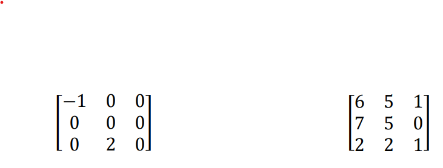

# Bidimensional-Array-Manipulation

### Bidimensional array manipulation using linear algebra and linked lists data structure.

---
<br>

# *Context*

 The solution of various problems in computing demand to use matrices and their operations. Matrices are [sparse](https://www.learndatasci.com/glossary/sparse-matrix/) when they are predominantly entered with zero. Diagonal matrices as the identity are examples of sparse matrices.<br><br>
 - First image represents a sparse matrix and the second one represents a dense matrix.<br><br>


<br><br><br>

In cases where the matrices have high dimensions, the use of a representation special for sparse matrices can substantially reduce memory usage and cost computation of operations. There are several ways to represent sparse matrices, each one seeking performance gains in a subset of operations. However, all representations assume that we only need to store and, whenever possible, use in operations, the values ​​different from zero.

---
<br>

# *Implementantion and Data Structure*

The data structure used to build the **Matrix** ADT (*[Abstract Data Type](https://eecs280staff.github.io/notes/07_ADTs_in_C.html)*) was based on double linked list (os just **[List](https://www.programiz.com/dsa/doubly-linked-list)**).


Basically, each matrix line is a linked list in which each **Node** ADT contains, internally, 4 Node pointers. So, I chose to use just one **List** array to represent the matrix to save memory and build the functions mostly manipulating the **Node**. 


```C
struct Matrix
{
    List **rows;
    int rows_size;
    int columns_size;
};
```

```C
struct List
{
    Node *head;
    Node *last;
    int size;
};

```

```C
struct Node
{
    data_type value;
    struct Node *row_next;
    struct Node *row_prev;
    struct Node *column_next;
    struct Node *column_prev;
    AxisCoordinates *coordinates;
};
```
<br>

><br>

> * All arrays are allocated dinamically and each ADT has their own free memory funcitons. 
> 
> * The user of these ADT just need to call the free functions to deallocate the [heap](https://opendsa-server.cs.vt.edu/ODSA/Books/CS2/html/HeapMem.html).
> 
> * Unfortunally, C does not have a *[garbage collector](https://learn.microsoft.com/en-us/dotnet/standard/garbage-collection/fundamentals)* like C# or Python, for example.
>
> <br>

---

### Example:

#### *Dense Matrix* :


---

#### *Stored*  :


---
---
<br>

# *Abstract Data Types Visualization*

## Matrix :
><br>

>```C
>struct Matrix
>{
>    List **rows;
>    int rows_size;
>    int columns_size;
>};
>```
>
><br>
>
> - Visual implementation : 
><br>
><br>
> 
>

<br>

---

<br>

## List
><br>

>   
> ```C
> struct List
> {
>     Node *head;
>     Node *last;
>     int size;
> };
> 
> ```
> <br>
>
> - Visual implementation : 
> <br>
> <br>
> 
> <br>
> <br>

<br>

---

<br>

 ## Node
><br>

>
>```C
>struct Node
>{
>    data_type value;
>    struct Node *row_next;
>    struct Node *row_prev;
>    struct Node *column_next;
>    struct Node *column_prev;
>    AxisCoordinates *coordinates;
>};
>```
> <br>
>
> - Visual implementation : 
> <br>
> <br>
> 
> <br>
> <br>

<br>

---
---

<br>
<br>

# Functions

1. Create and destruct matrix.
2. Assign values ​​to a node from row and column.
3. Read node values from row and column.
4. Fill matrix with zeros.
5. Fill matrix with sequential values.
6. Fill matrix with a custom array.
7. Sum two matrices.
8. Multiply a matrix by scalar.
9. Multiply two matrices by coordinates (like sum).
10. Standard matrix multiplication.
11. Swap matrix two rows.
12. Swap matrix two columns.
13. Create a slice from matrix.
14. Matrix transpose.
15. Read and write matrix in binary file.
16. Show matrix in dense format.
17. Show matrix in sparse format (with NULL where doesnt have node).
18. Show matrix in sparse format by coordinates [(x,y): value]
19. Make the matrix convolution (right below).

---

---

## *Convolution*

Here is a mathematician's domain. Most of filters are using convolution matrix. With the Convolution Matrix filter, if the fancy takes you, you can build a custom filter.

What is a convolution matrix? It's possible to get a rough idea of it without using mathematical tools that only a few ones know. Convolution is the treatment of a matrix by another one which is called “kernel”.

The Convolution Matrix filter uses a first matrix which is the Image to be treated. The image is a bi-dimensional collection of pixels in rectangular coordinates. The used kernel depends on the effect you want.

[Source: docs.gimp](https://docs.gimp.org/2.8/en/plug-in-convmatrix.html)


### *View*


---
---
<br>

# *C Main Program*

#### *Compile and run.*

```
$ make
$ make run
```

---


<br>

Each time you select one of menu options, a Python script (using [scipy](https://scipy.org/)) is called to generate random sparse matrices and save them into binary files. Then, the C source code open and read it to store into **Matrix** structure.

So, for each menu call, we have different sparse matrices to test the algorithm.

<br>


---

### *To profile and check the statistics*

<br>

```
$ make profile
```

You will find a file called by "analysis.txt" in "AlgorithmAnalysis" folder generated by gprof.

<br>

---

<br>

File data:


---


<br>
<br>

---
---

<br>

# *Final Notes*

- This project was focused on solve the sparse matrix problems and properties using the knowledge learned until the current date (2023-05-21) in **Data Sctructures** discipline offered by [Filipe Mutz](https://github.com/filipemtz) at *UFES - IT Departament*.

- Code owner: *[Gabriel Zuany Duarte Vargas](https://github.com/GabrielZuany)*


<br>

*Brazil, 2023-05-21*